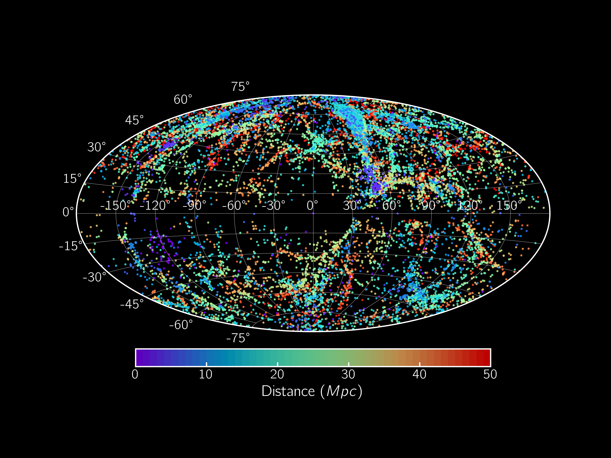

# 50 Mpc Galaxy Catalog

## Data Model
### *Columns included in the stripped sample are marked with :star:*

|Name    |Type |Units |Description |
|    :---:    |--- |--- |---|
|***Identifiers***| | | |
|`objname`:star:| | |Common galaxy name|
|`pgc`        | | |PGC number (from HyperLeda)|
|`nsa_id`| | |NASA-Sloan Atlas NSAID number|
|`group_id`| | |Galaxy is member of group, number based on Lambert et al. 2020 group catalog|
|`ra`:star:| |deg |Right Ascension combined from catalog sources|
|`dec`:star:| |deg |Declination combined from catalog sources|
|`ra_nsa`| |deg |Right Ascension provided by NSA|
|`dec_nsa`| |deg |Declination provided by NSA|
|`ra_ned`| |deg |Primary Right Ascension provided by NED|
|`dec_ned`| |deg |Primary Declination provided by NED|
|`d25`| |arcmin |Apparent Diameter from Karachentsev and HyperLeda|
|`v_h`:star:| |km/s |Heliocentric Radial velocity, see Section 3.1|
|`v_cmb`| |km/s |Radial velocity with respect to CMB radiation|
|`v_source`| | |Original source for compiled velocity: HyperLeda, LVG, NSA|
|`hl_obj`| | |True for objects in HyperLeda|
|`lvg_obj`| | |True for objects in Karachentsev's Catalog of Local Volume Galaxies|
|`nsa_obj`| | |True for objects in NASA-Sloan Atlas|
|`sga_obj`| | |True for objects in Sienna Galaxy Atlas|
|***Morphology***|- |- |***Section 5***|
|`t_type`:star:| | |Numerical Hubble T-Type|
|`color_type`| | |Color-based Type|
|`best_type`:star:| | |Combined galaxy type|
|***Photometry***|- |- |***Section 2***|
|`a_B_leda`| |mag |B-band extinction from Hyperleda multiplied by 0.86 to translate to Schlafly, A_V=0.769*a_B_leda and A_R=0.629*a_B_leda|
|`a_g_nsa`| |mag |g-band extinction from NASA-Sloan Atlas, the i-band extinction used is = 0.550 a_g_nsa|
|`EBV_irsa`| | |E(B-V) value from IRSA dust website Schlafly values for all galaxies.  Used only for the Siena Galaxy Atlas sources, A_g/EBV_sga=3.303, A_r/EBV_sga=2.285.|
|`Bt0_leda`| |mag |Extinction corrected total B band magnitude from HyperLeda|
|`BV_color_leda`| |mag |Extinction corrected (B-V) color from HyperLeda|
|`B_lum`| |[Lsun] |B-band Luminosity — derived for non-Hyperleda sources as described in Section 2.2|
|`gi_color_nsa`| |mag |Extinction corrected (g-i) color from NASA-Sloan Atlas|
|`i_lum_nsa`| |[Lsun] |i-Band Luminosity, calculated using M_i_sun=4.53|
|`gr_color_sga`| |mag |Extinction corrected (g-r) color from Sienna Galaxy Atlas|
|`r_lum_sga`| |[Lsun] |r-band Luminosity, calculated using M_r_sun=4.65|
|`BR_color_ned`| |mag |Extinction corrected (B-R) color from NED|
|`R_lum_ned`| |[Lsun] |R-band Luminosity from NED, calculated using M_R_sun=4.60|
|`BMag`| |mag |Estimated absolute B-Band Magnitude for all galaxies|
|`gi_color`| |mag |Estimated g-i color for all galaxies with color measurements|
|***Distance***|- |- |***Section 3***|
|`cf3_dist`| |Mpc |Distances from CosmicFlows3 Calculator|
|`cf3_dist_error`| |Mpc |Error on cf3_dist|
|`zind_dist`| |Mpc |Redshift independent distances|
|`zind_dist_error`| |Mpc |Error on zind_dist|
|`zind_indicator`| ||Redshift independent distance indicator listed in NEDD|
|`bestdist`:star:   | |Mpc |Our chosen best distance estimate|
|`bestdist_error`:star: | |Mpc |error for best distance estimate|
|`bestdist_method` | | |General method used for best distances: CF3-Z, Karachentsev, NED-D, Mei, Cantiello, EVCC, HyperLeda|
|`bestdist_source` | | |Source/Reference for bestdist, see Section 3|
|`dist_ned_flag`| | |Flags galaxies with NED-D best distance exceptions as described in Section 3.2|
|***Mass***|- |- |***Section 4***|
|`logmass_gi`| |[Msun] |log(M*) from (g-i)|
|`logmass_gr`| |[Msun] |log(M*) from (g-r)|
|`logmass_BV`| |[Msun] |log(M*) from (B-V)|
|`logmass_BR`| |[Msun] |log(M*) from (B-R)|
|`logmass`:star:    | |[Msun] |Compiled best log(M*) estimate|
|`logmass_error`:star:| |[Msun] |Error on logmass|
|`logmass_src`:star:| | |Color used for best mass estimate: g-i, g-r, B-V, B-R|
|***X-ray***|- |- |***Section 6***|
|`chandra_observation`| | |True if CSCView crossmatch returned a limiting sensitivity at matching position as described in Section 6|
|`chandra_detection`| | |True if CSCView crossmatch returned flux information within a 1" matching radius as described in Section 6|
|`log_lx`| | |X-ray luminosity log(L_x/erg/sec) calculated from the CSC 0.5-7 keV flux, using a 1" matching radius|
|`chandra_detection_3arcsec`| | |True if CSCView crossmatch returned flux information within a 3" matching radius as described in Section 6|
|'log_lx_3arcsec'| | |X-ray luminosity log(L_x/erg/sec) calculated from the CSC 0.5-7 keV flux, using a 3" matching radius|
